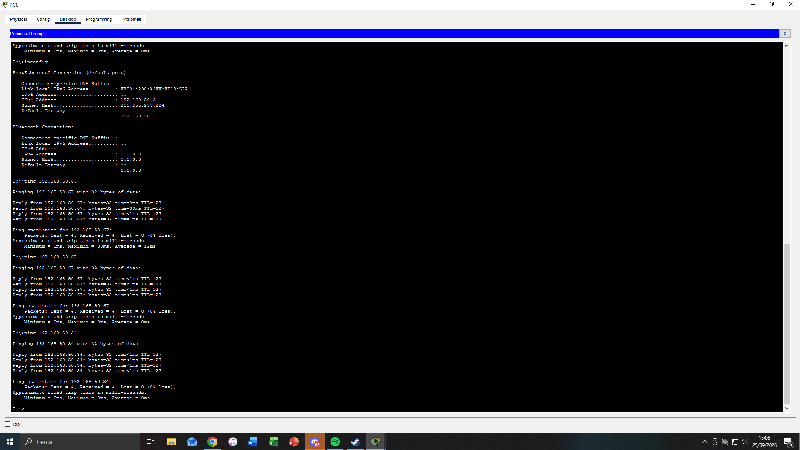

# Networking Foundation Capstone - Cisco Packet Tracer

## Objective

Design, configure and verify a small business network in Cisco Packet Tracer using the networking concepts covered during the course.

This project consolidates networking fundamentals before moving into Windows Server, Active Directory and infrastructure administration labs.

## Scenario

A small company has three departments that must be logically separated while still being able to communicate through inter-VLAN routing.

The network provides:

- Separate VLANs for IT, Administration and Sales
- IPv4 subnetting using /27 networks
- Access ports for end devices
- 802.1Q trunking
- Router-on-a-stick inter-VLAN routing
- Default gateways for each VLAN
- Connectivity verification

## Technologies

- Cisco Packet Tracer
- Cisco IOS
- IPv4
- Subnetting
- VLANs
- 802.1Q Trunking
- Router-on-a-stick
- Inter-VLAN Routing
- ICMP
- ARP

## Addressing Plan

| VLAN | Department | Network | Gateway |
|---|---|---|---|
| 10 | IT | 192.168.50.0/27 | 192.168.50.1 |
| 20 | ADMIN | 192.168.50.32/27 | 192.168.50.33 |
| 30 | SALES | 192.168.50.64/27 | 192.168.50.65 |

Subnet mask: `255.255.255.224`

## Topology


```text
                    Router
                      |
                    TRUNK
                      |
                    Switch
            __________|__________
           |          |          |
        VLAN 10    VLAN 20    VLAN 30
           IT       ADMIN       SALES
         PC0/PC1    PC2/PC3    PC4/PC5
```

## Repository Files

```text
cisco-packet-tracer-capstone/
│
├── README.md
│
├── packet-tracer/
│   └── small-business-network.pkt
│
├── configs/
│   ├── Router-running-config.txt
│   └── Switch-running-config.txt
│
└── screenshots/
    ├── topology.png
    └── ping.png
```

## Implementation

- [x] Define the network requirements
- [x] Create the IP addressing plan
- [x] Build the Packet Tracer topology
- [x] Configure VLANs
- [x] Configure access ports
- [x] Configure trunk link
- [x] Configure router-on-a-stick
- [x] Configure inter-VLAN routing
- [x] Configure end-device IP settings and default gateways
- [x] Verify connectivity between VLANs
- [x] Export router and switch configurations
- [x] Add screenshots
- [x] Add Packet Tracer project file
- [x] Complete troubleshooting exercise
- [x] Document final lessons learned

## Verification Commands

```text
show vlan brief
show interfaces trunk
show ip interface brief
show ip route
show running-config
ping
```

## Verification



Inter-VLAN connectivity was successfully tested from a host in the `192.168.50.0/27` subnet to hosts in the `192.168.50.32/27` and `192.168.50.64/27` subnets with 0% packet loss.

The final verification confirmed that:

- Devices in the same VLAN can communicate.
- Devices in different VLANs can communicate through the router.
- Each PC uses the correct default gateway.
- The switch has the expected access-port assignments for VLANs 10, 20 and 30.
- The switch-to-router link operates as an 802.1Q trunk.
- The router has three active subinterfaces for the three /27 networks.

## Troubleshooting Exercise

A deliberate Layer 2 configuration error was introduced on a SALES workstation port.

### Symptom

The workstation could no longer reach its default gateway or hosts outside its expected VLAN.

### Fault Introduced

The access port connected to the SALES workstation was intentionally assigned to VLAN 20 instead of VLAN 30.

### Investigation

The troubleshooting process followed a layered approach:

1. Tested connectivity from the affected workstation.
2. Verified whether another host in VLAN 30 could reach the gateway.
3. Verified same-VLAN communication.
4. Inspected VLAN membership with:

```text
show vlan brief
```

This isolated the issue to the switch access-port VLAN assignment rather than the router or trunk.

### Root Cause

The workstation's switch port was assigned to the wrong VLAN.

The host still had an IP address and default gateway belonging to the `192.168.50.64/27` SALES subnet, but its Layer 2 traffic was being placed in VLAN 20.

### Corrective Action

The affected switch port was reassigned to VLAN 30.

After restoring the correct VLAN membership, connectivity was re-tested. Packet Tracer briefly required additional time/traffic before gateway reachability was restored, after which same-VLAN and inter-VLAN communication both succeeded.

### Final Verification

- PC4 -> PC5: successful
- PC5 -> VLAN 30 gateway: successful
- PC4 -> VLAN 30 gateway: successful after restoration
- Inter-VLAN communication: successful

## What I Learned

- A VLAN separates a Layer 2 broadcast domain even when devices are connected to the same physical switch.
- Access ports must belong to the VLAN that matches the host's intended IP subnet.
- An 802.1Q trunk can carry traffic for multiple VLANs over one physical link.
- Router-on-a-stick uses one physical router interface with multiple logical subinterfaces, one for each VLAN.
- The physical router interface does not need an IP address when Layer 3 addressing is configured on the VLAN subinterfaces.
- Each router subinterface acts as the default gateway for its VLAN.
- `show vlan brief`, `show interfaces trunk`, `show ip interface brief` and `show ip route` are useful for isolating Layer 2 and Layer 3 faults.
- Testing connectivity in stages helps identify whether a problem is local to the host, inside the VLAN, on the trunk, or at the router.
- A working configuration should always be verified after a corrective change instead of assuming that the fix was successful.
