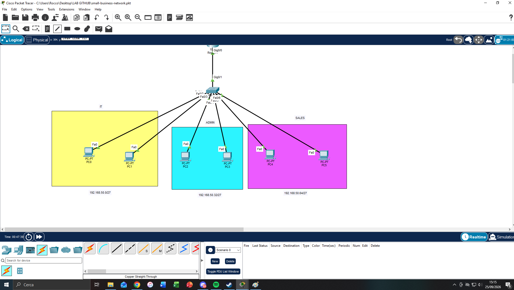

# Networking Foundation Capstone - Cisco Packet Tracer

## Objective

Design, configure and verify a small business network in Cisco Packet Tracer using the networking concepts covered during the course.

This project consolidates networking fundamentals before moving into Windows Server, Active Directory and infrastructure administration labs.

## Scenario

A small company has three departments that must be logically separated while still being able to communicate through inter-VLAN routing.

The network provides:

- Separate VLANs for IT, Administration and Sales
- IPv4 subnetting using /27 networks
- Access ports for end devices
- 802.1Q trunking
- Router-on-a-stick inter-VLAN routing
- Default gateways for each VLAN
- Connectivity verification

## Technologies

- Cisco Packet Tracer
- Cisco IOS
- IPv4
- Subnetting
- VLANs
- 802.1Q Trunking
- Router-on-a-stick
- Inter-VLAN Routing
- ICMP
- ARP

## Addressing Plan

| VLAN | Department | Network | Gateway |
|---|---|---|---|
| 10 | IT | 192.168.50.0/27 | 192.168.50.1 |
| 20 | ADMIN | 192.168.50.32/27 | 192.168.50.33 |
| 30 | SALES | 192.168.50.64/27 | 192.168.50.65 |

Subnet mask: `255.255.255.224`

## Topology



```text
                      R1
                      |
                    TRUNK
                      |
                     SW1
            __________|__________
           |          |          |
        VLAN 10    VLAN 20    VLAN 30
           IT       ADMIN       SALES
         PC1/PC2    PC3/PC4    PC5/PC6
```

## Repository Files

The completed project should contain:

```text
cisco-packet-tracer-capstone/
│
├── README.md
│
├── packet-tracer/
│   └── small-business-network.pkt
│
├── configs/
│   ├── Router-running-config.txt
│   └── Switch-running-config.txt
│
└── screenshots/
    ├── topology.png
    └── ping.png
```

## Implementation

- [x] Define the network requirements
- [x] Create the IP addressing plan
- [x] Build the Packet Tracer topology
- [x] Configure VLANs
- [x] Configure access ports
- [x] Configure trunk link
- [x] Configure router-on-a-stick
- [x] Configure inter-VLAN routing
- [x] Configure end-device IP settings and default gateways
- [x] Verify connectivity between VLANs
- [x] Export router and switch configurations
- [x] Add screenshots
- [x] Add Packet Tracer project file
- [ ] Complete troubleshooting exercise
- [ ] Document final lessons learned

## Verification Commands

```text
show vlan brief
show interfaces trunk
show ip interface brief
show ip route
show running-config
ping
```

## Verification


Inter-VLAN connectivity was successfully tested from a host in the 192.168.50.0/27 subnet to hosts in the 192.168.50.32/27 and 192.168.50.64/27 subnets, with 0% packet loss.

The network is considered successfully configured when:

- Devices in the same VLAN can communicate.
- Devices in different VLANs can communicate through R1.
- Each PC uses the correct default gateway.
- SW1 shows VLANs 10, 20 and 30 with the expected access ports.
- The switch-to-router link operates as an 802.1Q trunk.
- R1 shows the three configured subinterfaces and connected /27 networks.

## Troubleshooting Scenario

A deliberate configuration issue will be introduced in the next phase.

The investigation will document:

- Symptom
- Initial hypothesis
- Commands used
- Root cause
- Corrective action
- Final verification

## What I Learned

To be completed after the troubleshooting phase.
